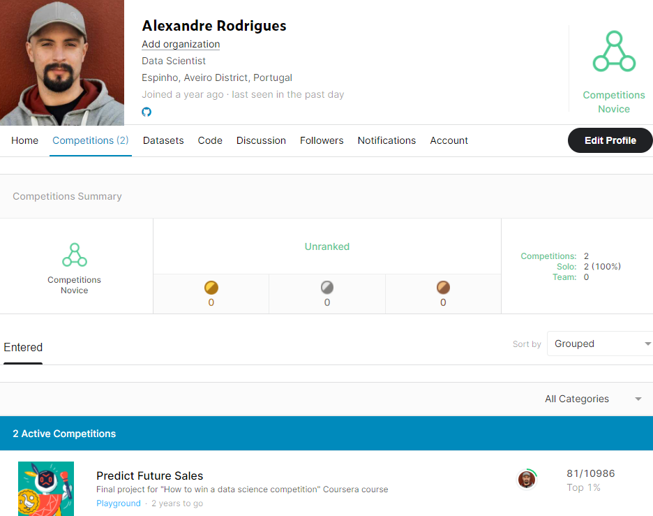

# teste
 
 falat um dos ficheiros e preciso rodar o primeiro notebook para o ter
 
# Data Science Salary Estimator: Project Overview 
In this competition the objective was to predict future sales for a Russian firm 1C Company. The prediction should contain next month sales for 5100 items at each of the 42 shops, with predictions being clipped into the range (0,20). The performance metric was RMSE. To inform these predictions we were given sales data covering the 33 months prior to the test period. 

At the end I reached a very good score with an RMSE of only 0.85256 witch put me in the top 1% of the competition.



## Code and Resources Used 
**Python Version:** 3.7  
**Packages:** pandas, numpy, sklearn, matplotlib, seaborn, selenium, flask, json, pickle  
**For Web Framework Requirements:**  ```pip install -r requirements.txt```  
**Flask Productionization:** https://towardsdatascience.com/productionize-a-machine-learning-model-with-flask-and-heroku-8201260503d2

## Web Scraping
Scraped 800 job postings from glassdoor.com. With each job, we got the following:
*	Job title
*	Salary Estimate
*	Job Description
*	Rating
*	Company 
*	Location
*	Company Size
*	Company Founded Date
*	Type of Ownership 
*	Industry
*	Sector
*	Revenue

## Data Cleaning
After scraping the data, I needed to clean it up so that it was usable for our model. I made the following changes and created the following variables:

*	Parsed numeric data out of salary 
*	Made columns for employer provided salary and hourly wages 
*	Removed rows without salary 
*	Parsed rating out of company text 
*	Made a new column for company state 
*	Transformed founded date into age of company 
*	Made columns for if different skills were listed in the job description:
    * Python  
    * R  
    * Excel  
    * AWS  
    * Spark 
*	Column for simplified job title and Seniority 
*	Column for description length 

## EDA
I looked at the distributions of the data and the value counts for the various categorical variables.

## Model Building 

First, I transformed the categorical variables into dummy variables. I also split the data into train and tests sets with a test size of 20%.   

I tried three different models and evaluated them using Mean Absolute Error. I chose MAE because it is relatively easy to interpret and outliers aren’t particularly bad in for this type of model.   

I tried three different models:
*	**Multiple Linear Regression** – Baseline for the model
*	**Lasso Regression** – Because of the sparse data from the many categorical variables, I thought a normalized regression like lasso would be effective.
*	**Random Forest** – Again, with the sparsity associated with the data, I thought that this would be a good fit. 

## Model performance
The Random Forest model far outperformed the other approaches on the test and validation sets. 
*	**Random Forest** : MAE ~ 14

## Productionization 
In this step, I built a flask API endpoint that was hosted on a local webserver by following along with the TDS tutorial in the reference section above. The API endpoint takes in a request with a list of values from a job listing and returns an estimated salary. 
